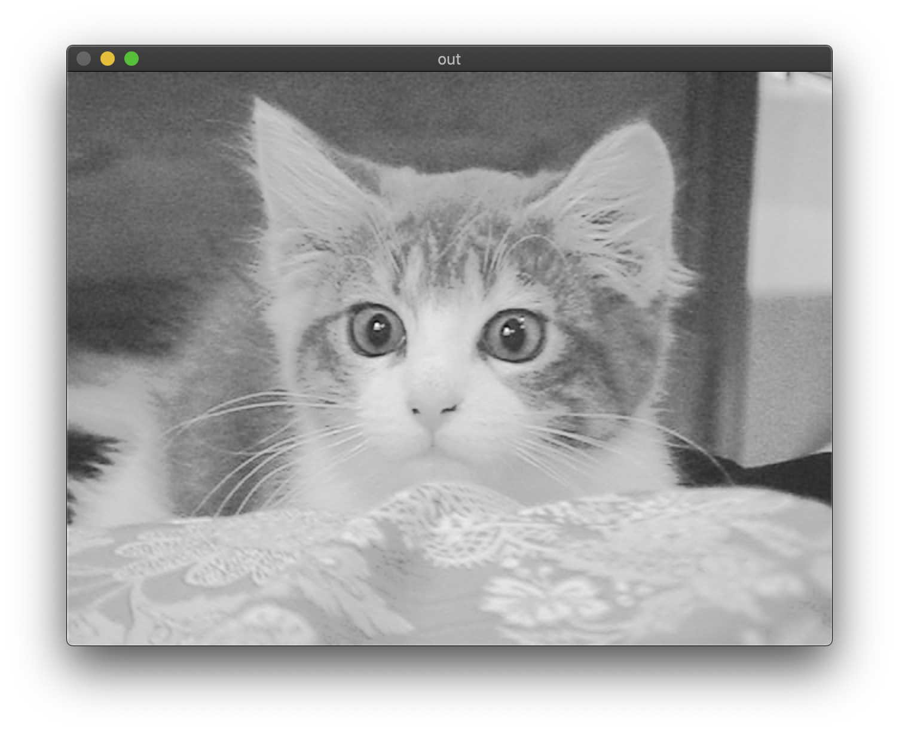
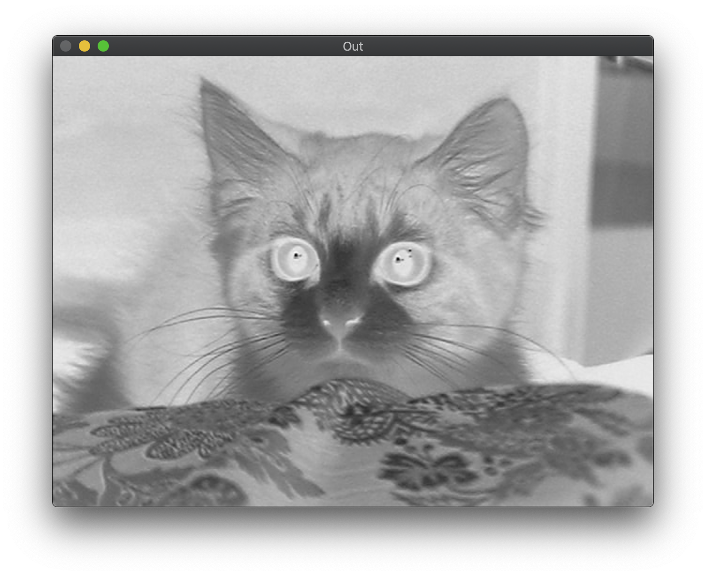
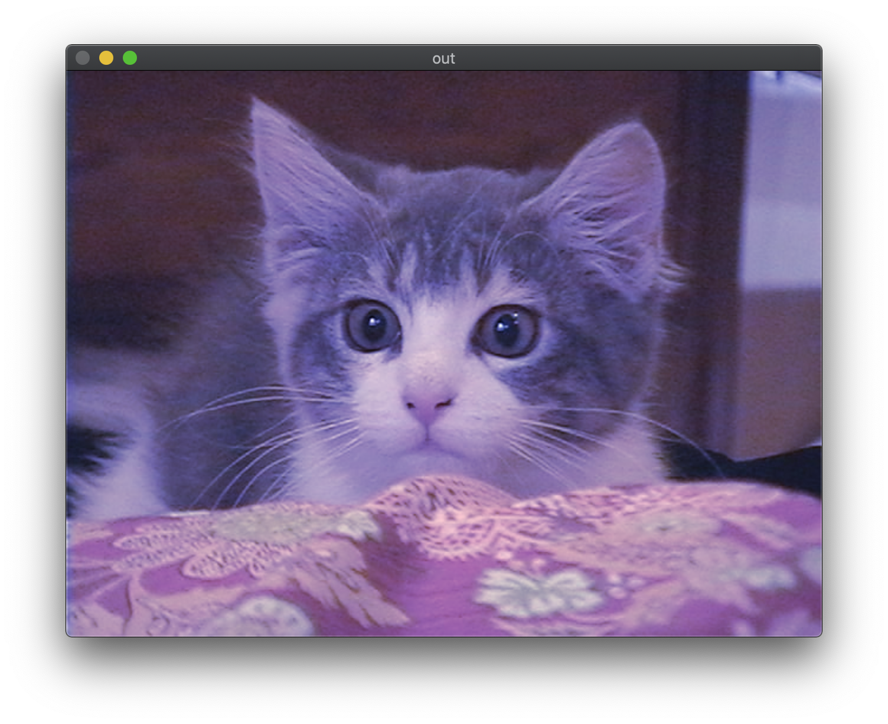
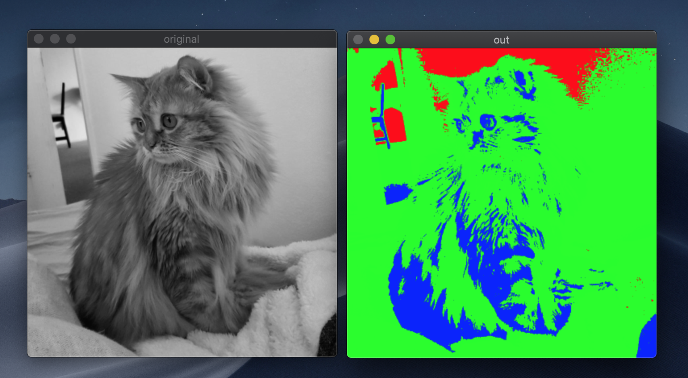
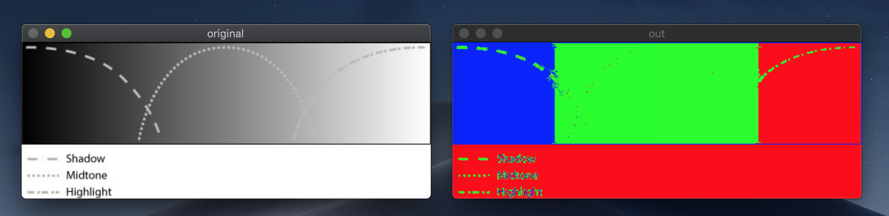
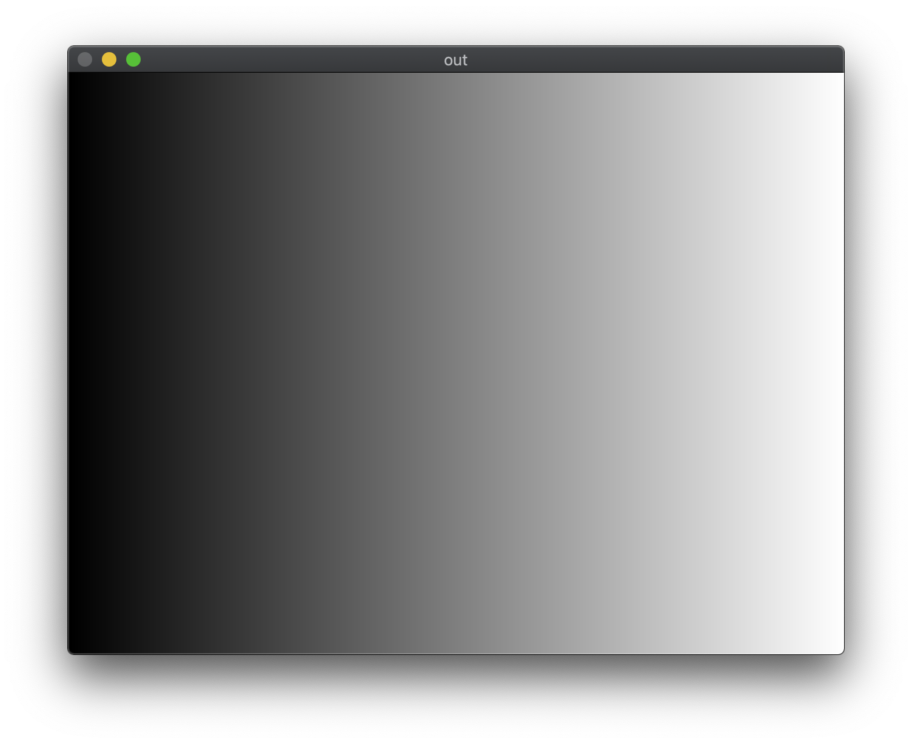
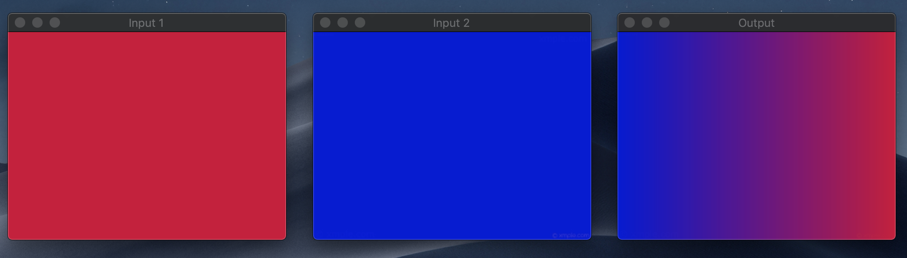

# FI科　画像処理および演習

##Lecture 04

### 演習1 : コントラスト変換
[ex4-toneByEq.cpp](Ex4/ex4-toneByEq.cpp)

### 演習2 : コントラスト変換
[ex4-toneByTable.cpp](Ex4/ex4-toneByTable.cpp)

### 演習3 : コントラスト変換
[ex4-blueToneByEq.cpp](Ex4/ex4-blueToneByEq.cpp)

### 演習4 : 疑似カラー生成
[ex4-pesudoColor.cpp](Ex4/ex4-pesudoColor.cpp)

### 演習5 : アルファブレンディングのマスク生成
[ex4-blendMask.cpp](Ex4/ex4-blendMask.cpp)

### 演習6 : 任意の2枚の画像を演習6のマスクを用いてアルファブレンディングせよ
[ex4-toneByEq.cpp](Ex4/ex4-alphablend.cpp)

